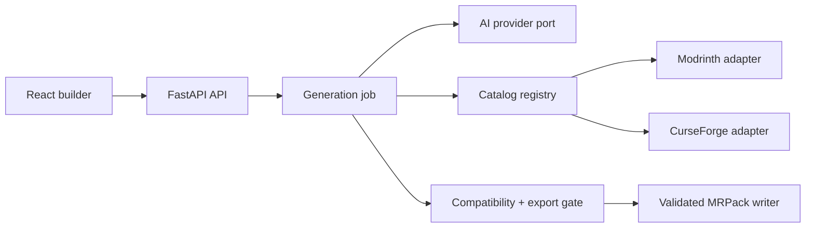

# MrPackMaker architecture

MrPackMaker is designed as a local-first application with stable domain
boundaries. The web interface only communicates with FastAPI; API keys and
catalog/AI traffic never pass through the browser.

## Boundaries

- `app/services/ai_provider.py` defines the OpenAI-compatible AI boundary.
  LM Studio, a LiteLLM gateway (including Ollama), and another compatible
  endpoint differ only by configuration today. A provider with a different
  transport implements the same protocol.
- `app/services/source_registry.py` is the catalog extension point. A new mod
  source supplies `source_id`, `search`, `get_mod_detail`, `available`, and
  `close`; it does not require a change to the resolver or pack builder. Mod
  source IDs are strings rather than a fixed database enum for this reason.
- `app/services/ai_orchestrator.py` uses a fresh database session for each
  background job and stores a `generation_runs` audit record. It never holds
  the request's session after the HTTP response ends.
- `app/services/mrpack_validation.py` is a shared export gate. It rejects
  missing loader versions, files, URLs, hashes, sizes, unsafe paths, duplicate
  mods, and duplicate archive paths. The writer never skips an invalid mod.

## Data and security

`config.json` holds public operational settings only. Sensitive values use
environment variables in production (`MRPACK_AI_API_KEY`,
`MRPACK_MODRINTH_KEY`, `MRPACK_CURSEFORGE_KEY`, `MRPACK_ADMIN_TOKEN`) and can
be changed by the protected admin API. Admin-managed values are encrypted in
`data/secrets.enc`; use `MRPACK_SECRET_KEY` from a real secret manager for a
deployment. The local fallback key is for a single-user desktop installation,
not a multi-user server.

The admin endpoint requires `X-Admin-Token` and never returns secret values;
it only returns masked state. The project PATCH endpoint intentionally cannot
alter server-owned output paths or generation status.

## Extending mod support

Add an adapter that implements `ModCatalogProvider`, then register it in the
application composition root (currently `create_default_registry`). It must
return a `ModEntry` with a source ID, compatible file, download URL, file size,
and SHA-1 or SHA-512 hash. That same metadata is used by search, dependency
resolution, compatibility, and MRPack export.

## Operational next steps

For a networked deployment, add real user accounts/roles before exposing the
admin API, move job execution to a durable worker queue, and replace the small
additive SQLite migration bootstrap with Alembic. The current structure keeps
those changes at infrastructure boundaries rather than inside pack logic.
